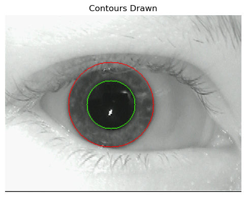
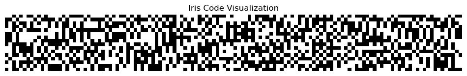

# Iris Recognition System

## Overview
This project implements an iris recognition system that performs segmentation, feature extraction, and matching of iris patterns. The system consists of two main components:
1. **IrisSegmenter**: Handles iris segmentation and unwrapping
2. **IrisRecognizer**: Performs feature extraction and matching using Gabor filters

## Features
- Iris segmentation with pupil and boundary detection
- Iris unwrapping to rectangular representation
- 8-band decomposition for feature extraction
- Gabor filter-based feature encoding
- Hamming distance for iris code comparison
- Visualization tools for each processing step

